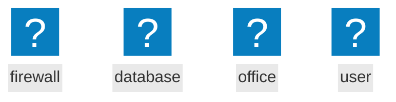

```mermaid
architecture-beta
    group api(logos:aws-lambda)[API]
    service db(logos:aws-aurora)[Database] in api
    service disk1(logos:aws-glacier)[Storage] in api
    service disk2(logos:aws-s3)[Storage] in api
    service server(logos:aws-ec2)[Server] in api
    db:L -- R:server
    disk1:T -- B:server
    disk2:T -- B:db
```

# Live-Preview
Live Preview is a neovim plugin, designed to generate realtime preview of markdown and textile documents while editing in neovim. The idea was inspired by the retiread iamcco/markdownpreview.nvim plugin.

## Installation

### Lazy

add the following to you setup function

```
{"hostmyapps-git/live-preview.nvim",
			build = "npm install --prefix .",
			config = function()
				require ("live-preview").setup()
end,
},
```

## Commands
* `:LivePreview`
* `:LivePreviewStop`
* `:LivePreviewDebug on|off`

## Language Support

Currently the preview of the following filetypes is supported
* markdown 
* textile
* svg

If not detected automatically set it with `:setfiletype markdown`, `:setfiletype textile`, `:setfiletype svg`

## General aspect

* currently only one document at a time
* Browser tab needs to be closed manually


## Diagram Support

* Mermaid Diagrams are supportet by using ` ```mermaid`
* Graphviz and dot is supported by using ` ```dot`
* Plantuml is supported by using ` ```plantuml`
* Math is supported by katex by using ` ```katex`
* Chemistry is supported by katex mhchm by using ` ```mhchem`
* svg is supported by using ` ```svgimg`

SVG based diagrams can be saved directly from the browser (including all styles, references from `<use>` elements, etc.). This is useful for `svgimg`, `mermaid`, `graphviz` and `plantuml`.

### Mermaid

Lucide, Fontawesome6-solid, Affinity and Tabler and Logos are included as default iconpacks. Custom iconpacks can be included in the config. 

#### Logos

````

````

#### Fontawesome6-solid, Affinity, Tabler

````

````

