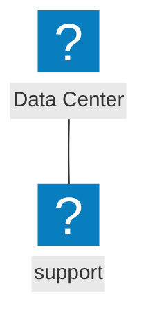
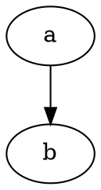

# Live-Preview
Live Preview is a neovim plugin, designed to generate realtime preview of markdown and textile documents while editing in neovim. The idea was inspired by the retiread iamcco/markdownpreview.nvim plugin.

## General aspect

* currently only one document at a time
* Browser tab needs to be closed manually
* 

## Language Support

Currently the preview of markdown and textile files is supported

## Diagram Support

### Mermaid

Mermaid Diagrams are supportet

<pre><code>```mermaid
flowchart
a@{label: mermaid}
b@{label: support}
a --> b
```</code> </pre>

renders to





```mermaid
---
config:
    themeCSS: 
        g#service-dc path {fill:crimson;}
        g#service-securityinterface_1 path {stroke:crimson;fill:indigo}
        g#service-securityinterface_2 path {stroke:crimson;fill:indigo}
        rect#group-vs {stroke:crimson;}
        path#L_security_admin_0 {stroke:transparent;}
---
architecture-beta
group vs(fa6-solid:lock)[VS Netz]
group helpdesk(fa6-solid:headset)[Helpdesk Admin Monitoring Logging etc] in vs
service dc(fa6-solid:building)[datacenter] in vs
service admin(fa6-solid:user-gear)[admin] in helpdesk
service security(fa6-solid:user-shield)[admin] in helpdesk
service user1(fa6-solid:laptop)[user] in vs
service user2(fa6-solid:ellipsis) in vs
service user3(fa6-solid:laptop)[user] in vs
service securityinterface_1(tabler:wall)[RS Gateway] in vs
service securityinterface_2(tabler:wall)[RS Gateway] 
service internet(fa6-solid:cloud)[internet]
junction junctionUsersDc_1 in vs
junction junctionUsersDc_2 in vs
junction junctionUsersDc_3 in vs
dc:B -- T:junctionUsersDc_2
junctionUsersDc_1:R -- L:junctionUsersDc_2
junctionUsersDc_3:L -- R:junctionUsersDc_2
user1:T -- B:junctionUsersDc_1
user2:T -- B:junctionUsersDc_2
user3:T -- B:junctionUsersDc_3
dc:R -- L:securityinterface_1
securityinterface_1:R -- L:securityinterface_2
securityinterface_2:R -- L:internet
junction junctionAdminsDC_3 in vs
security{group}:R -- L:dc
security:L -- R:admin
```

### Graphviz / Dot

Graphviz and dot is supported

<pre><code>```dot
digraph
```</code></pre>

renders to



### Plantuml

Plantuml is supported.

```plantuml
Alice --> Bob
```

## Math Support

Math is supported by KATEX

```
$f(x)=y^2$
```

renders to

$f(x)=y^2$


```
$$
x = y^2
y = \sqrt x
$$
```

renders to

$$
x = y^2\\\\
y = \sqrt x\\\\
$$

```mhchem
$\ce{ CO2 + C -> 2 CO}$
```

renders to


$\ce{ CO2 + C -> 2 CO}$


