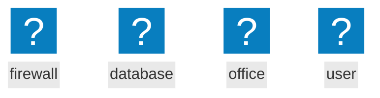

```mermaid
architecture-beta
    group api(logos:aws-lambda)[API]
    service db(logos:aws-aurora)[Database] in api
    service disk1(logos:aws-glacier)[Storage] in api
    service disk2(logos:aws-s3)[Storage] in api
    service server(logos:aws-ec2)[Server] in api
    db:L -- R:server
    disk1:T -- B:server
    disk2:T -- B:db
```

# 📝Live-Preview
Live Preview is a neovim plugin, designed to generate realtime preview of markdown and textile documents while editing in neovim. The idea was inspired by the retired [iamcco/markdownpreview.nvim](https://github.com/iamcco/markdown-preview.nvim) plugin.

## Installation

### Lazy

add the following to you setup function

```lua
{"hostmyapps-git/live-preview.nvim",
    build = "npm install --prefix .",
    config = function()
        require ("live-preview").setup()
    end,
},
```

## Configuration

node and npm need to be installed.

Insert the following to your nvim configuration

```lua
vim.g.live_preview_options = {
    general = {
        autoscroll = true,
        width = "100%",
    },
    libraries = {
			-- { name = "your script",  path = "path to your script" },
    },
    stylesheets = {
        { name = "stylesheet name", path="path to your stylesheet"},
    },
    mermaid = {
        iconsets ={
            { name = "fa6-solid", path = "iconpacks/fa6-solid.json" },
            { name = "logos",     path = "iconpacks/logos.json" },
            { name = "tabler",    path = "iconpacks/tabler.json" },
            { name = "lucide",    path = "iconpacks/lucide.json" },
            { name = "affinity",  path = "iconpacks/affinity.json" },
            -- { name = "your_icon_pack",  path = "path to your iconpack" },
        },
    },
    plantuml = {
        server = "localhost:8080",
        imageFormat = "svg",
    },
    svg={
        iconsets = { 
            { name = "fa6-solid", path = "iconpacks/fa6-solid.json" },
            { name = "logos",     path = "iconpacks/logos.json" },
            { name = "tabler",    path = "iconpacks/tabler.json" },
            { name = "lucide",    path = "iconpacks/lucide.json" },
            { name = "affinity",  path = "iconpacks/affinity.json" },
            -- { name = "your_icon_pack",  path = "path to your iconpack" },
        },
    },
}
```

## Commands
* `:LivePreview`
* `:LivePreviewStop`
* `:LivePreviewDebug on|off`

## Language Support

Currently the preview of the following filetypes is supported
* markdown 
* textile
* svg

If not detected automatically set it with `:setfiletype markdown`, `:setfiletype textile`, `:setfiletype svg`

## General aspect

* currently only one document at a time
* Browser tab needs to be closed manually


## Diagram Support

* Mermaid Diagrams are supportet by using ` ```mermaid`
* Graphviz and dot is supported by using ` ```dot`
* Plantuml is supported by using ` ```plantuml`
* chart.js is supported by using ` ```chart`
* Math is supported by katex by using ` ```katex`
* Chemistry is supported by katex mhchm by using ` ```mhchem`
* svg is supported by using ` ```svgimg`

SVG based diagrams can be saved directly from the browser (including all styles, references from `<use>` elements, etc.). This is useful for `svgimg`, `mermaid`, `graphviz` and `plantuml`.

### Mermaid

Lucide, Fontawesome6-solid, Affinity and Tabler and Logos are included as default iconpacks. Custom iconpacks can be included in the config. 

#### Logos

````

````

#### Fontawesome6-solid, Affinity, Tabler

````

````

## Trouble Shooting

1. exit vim
2. `killall node`
3. open the trouble file in vim again
4. run `:LivePreviewDebug on`.
5. run `:LivePreview`
6. check log files
    - vim plugin log: .cache/nvim/live_preview.log.
    - server.js log: server_error.log
    - last_payload.json

## 3rd Party software

### Libraries

The following libraries are included in `static/libs`. Setup your own libraries in the configuration object if required.

| Library                                                               | Version |
|-----------------------------------------------------------------------|---------|
| [chart.js](https://github.com/chartjs/Chart.js)                       | 4.5.1   |
| [highlight.js](https://github.com/highlightjs/highlight.js)           | 11.11.1 |
| [katex](https://github.com/KaTeX/KaTeX)                               | 0.16.25 |
| [markdown-it](https://github.com/markdown-it/markdown-it)             | 14.1.0  |
| [mermaid.js](https://github.com/mermaid-js/mermaid)                   | 11.12.0 |
| [plantuml-encoder](https://github.com/markushedvall/plantuml-encoder) | 1.4.0   |
| [textile.js](https://github.com/borgar/textile-js)                    | 2.1.1   |
| [viz-js](https://github.com/markushedvall/plantuml-encoder)           | 3.20.0  |

### Iconpacks

The following iconpacks are included in `static/iconpacks`. Setup your own iconpacks in the configuration object if required.

| Iconpack | Version |
| ---|---|
| [affinity](https://github.com/ecceman/affinity)| 2025-10-14 |
| [@iconify-json/fa6-solid](https://icon-sets.iconify.design/fa6-solid/) | 1.2.4 |
| [@iconify-json/logos](https://icon-sets.iconify.design/logos/) | 1.2.9 |
| [@iconify-json/lucide](https://icon-sets.iconify.design/lucide/) | 1.2.69 |
| [@iconify-json/tabler](https://icon-sets.iconify.design/tabler/) | 1.2.23 |

